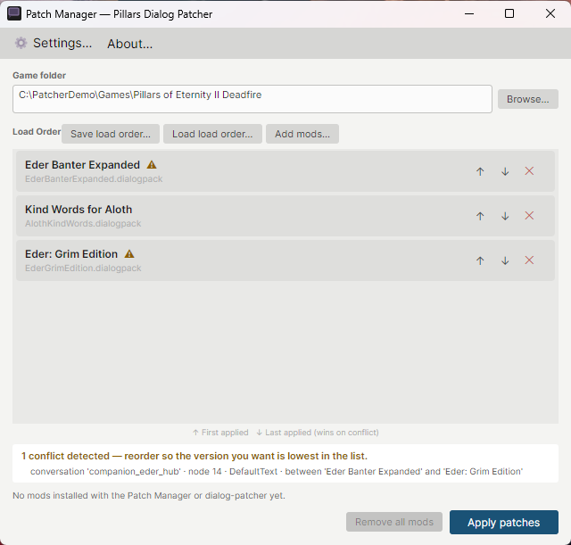
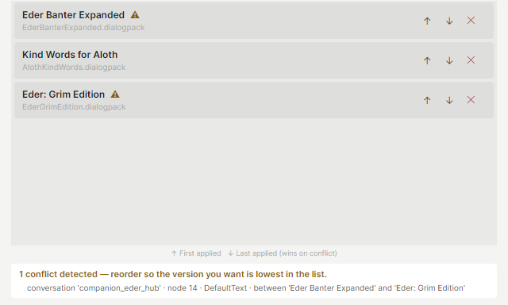

# Pillars Dialog Patcher — player guide

The Pillars Dialog Patcher installs conversation mods for *Pillars of Eternity* and
*Pillars of Eternity II: Deadfire*. Mods come as `.dialogpack` files. You don't need the
Pillars Dialog Editor, or any other tool, to install them.

**Nothing is permanent.** Before the patcher changes a game file, it keeps a copy of the
original. You can remove every mod and get the original game files back at any time
(see [Removing mods](#removing-mods)).



## What's in this folder

| File | What it's for |
|---|---|
| `DialogEditor.PatchManager.exe` | **Start here.** The Patch Manager: add mods, choose your game folder, apply. |
| `README.md` | This guide. |
| `images\` | The pictures in this guide. |
| `cli\dialog-patcher.exe` | The command-line version, for mod installers and scripts (see [the end of this guide](#for-installer-and-script-authors)). You don't need it to install mods yourself. |
| `runtime\` | The .NET runtime both programs use, so you don't have to install .NET. Keep it next to the other files. |

You can unzip the folder anywhere, for example to your Desktop or Documents. It doesn't
need to be inside the game folder.

## Installing a mod

1. Start `DialogEditor.PatchManager.exe`.
2. Next to **Game folder**, click **Browse…** and choose the folder the game is installed
   in. It's the folder that contains `PillarsOfEternityII_Data` (Deadfire) or
   `PillarsOfEternity_Data` (the first game). Typical places:
   - Steam: `C:\Program Files (x86)\Steam\steamapps\common\Pillars of Eternity II`
   - GOG Galaxy: `C:\Program Files (x86)\GOG Galaxy\Games\Pillars of Eternity II Deadfire`
     (the first game: `…\Games\PillarsOfEternity`)

   In Steam you can also right-click the game and choose *Manage → Browse local files*;
   in GOG Galaxy, *Manage installation → Show folder*.
3. Click **Add mods…** and choose the mod's `.dialogpack` file. You can pick several at once.
4. Click **Apply patches**.
5. Start the game.

If the Patch Manager says *"Folder not recognised as PoE1 or PoE2 root"*, you picked a
folder above or below the right one. Pick the folder that directly contains the `…_Data`
folder.

## Using several mods: load order

Every mod you add goes into the **Load Order** list. When you click **Apply patches**, the
patcher puts the original game files back and then applies the mods from the top of the
list to the bottom.

When two mods change the same line of a conversation, **the mod lower in the list wins**.
Use the ↑ and ↓ buttons on each row to change the order.



The patcher checks for this as soon as you add mods, before anything is installed:

- Both mods get a yellow ⚠ next to their name. Hover over it for a reminder of what to do.
- The panel under the list says how many conflicts it found and lists each one: which
  conversation, which line (node), what both mods change, and which two mods they are.

A conflict isn't an error. Mods that are meant to change another mod ("compatibility
patches") must go below the mod they change. If two unrelated mods conflict, decide which
version of the line you want and put that mod lower. The mod higher in the list still
installs; it just loses on those lines.

### Keeping your list

The Patch Manager doesn't remember the list when you close it. Click **Save load order…**
to save it as a `.patchlist` file, and **Load load order…** to get it back next time. You
need the list again to add another mod, remove one, or re-apply after a game update.

## Removing mods

**One mod:** load your list (or add your mods again), remove the mod with the ✕ button on
its row, and click **Apply patches**. Because every apply starts from the original game
files, the removed mod is gone and the others are installed again.

**Every mod:** click **Remove all mods** and confirm. Every game file the patcher changed
is put back to its original, and every file it added is deleted. The list stays in the
window, so you can apply it again later.

The patcher keeps the original files and its record of what it changed in a folder called
`PillarsDialogPatcher` inside the game folder. Leave it alone while mods are installed;
without it the patcher can't restore the originals.

## After a game update

A game update (or your storefront's "verify files") can replace files the patcher had
modded. The next time you click **Apply patches**, the Patch Manager lists those files and
asks what to do:

- **Treat as new originals** — the updated files become the new originals, and your mods
  are applied on top of them. This is usually what you want.
- **Cancel** — nothing is changed.

If a mod was made for an older version of the game, some of its lines may no longer match
and it may not apply cleanly. Check the mod's page for an update.

## When something goes wrong

**"This mod needs a newer patcher."** The mod was made with a newer editor than this
patcher understands. Nothing was changed. Download the newest Pillars Dialog Patcher
(releases named `patcher-v…`) from
<https://github.com/kjmikkel/PillarsDialogEditor/releases>, or click **About… → Get the
latest patcher**. **About…** also lists which mod formats this patcher can install.

**"The patcher's backup record is unreadable."** The file in which the patcher records
what it changed is damaged, so it can't safely undo anything. Nothing was changed. To get
back to a clean game: use your storefront's "verify game files" (Steam: *Properties →
Installed Files → Verify integrity of game files*; GOG Galaxy: *Manage installation →
Verify / Repair*), then delete the `PillarsDialogPatcher` folder inside the game folder.
You can then install your mods again.

**A mod shows *⚠ could not load*.** The file is damaged or isn't a mod. Download it again.

**Still stuck?** Ask on the mod's page, or open an issue at
<https://github.com/kjmikkel/PillarsDialogEditor/issues>. Mention your game, where you got
it (Steam, GOG, …) and the message you saw.

## For installer and script authors

`cli\dialog-patcher.exe` does the same as the Patch Manager, from a terminal. It shares the
same backup, so the two can be used on the same game folder.

```
cli\dialog-patcher.exe <game-dir> <mod.dialogpack> [more mods …] [options]
cli\dialog-patcher.exe <game-dir> --restore
```

Mods are applied in the order given; **later mods win** on conflicting lines, and every
conflict is printed as a warning first. Each run restores the originals before applying,
so running it with a different list replaces the previous mods.

| Option | Effect |
|---|---|
| `--restore` | Remove every mod: put back the original files and delete added files. |
| `--accept-current-files` | Treat files changed since the last apply (usually by a game update) as the new originals, then apply. |
| `--dry-run` | Check the mods and plan the apply without writing anything. |
| `-f`, `--force` | Apply even where the game's current text doesn't match what a mod expects. |
| `-v`, `--verbose` | Print each conversation as it is patched. |
| `-q`, `--quiet` | Print errors only. |
| `--version` | Print the version and the mod formats it reads. |
| `-h`, `--help` | Show the full help. |

| Exit code | Meaning |
|---|---|
| `0` | Success (apply, restore or dry run). |
| `1` | A mod doesn't match the game's current text. The originals were restored; nothing is half-applied. Re-run with `--force` to apply anyway. |
| `2` | Bad arguments, a missing file, a folder that isn't a Pillars game, or an unreadable backup record. |
| `3` | Files the patcher manages were changed by something else. Nothing was written. Re-run with `--accept-current-files`, or with `--restore`. |
| `4` | A mod needs a newer patcher. Nothing was changed. |

## Not affiliated with Obsidian

Pillars Dialog Patcher is a free fan-made tool. It is not made, endorsed or supported by
Obsidian Entertainment or the games' publishers. *Pillars of Eternity* and *Pillars of
Eternity II: Deadfire* are trademarks of their respective owners. The patcher
contains no game files: it changes the files of a copy of the game you own. Please don't
contact Obsidian about problems with mods or with this tool.
